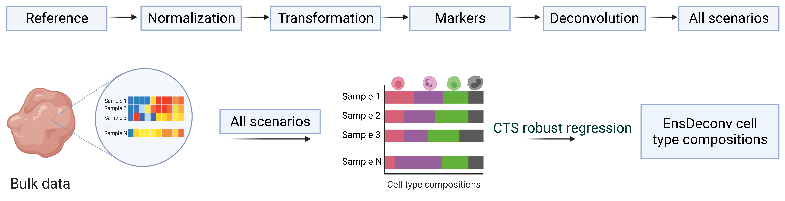

# EnsDeconv
EnsDeconv (Ensemble Deconvolution) which uses ensemble learning to to robustly estimate cellular fractions from bulk omics data.

## Installation
```
devtools::install_github("randel/EnsDeconv",dependencies = T)
```

## Workflow



More Information
-----------------
Please see [Tutorial](https://randel.github.io/EnsDeconv/).
