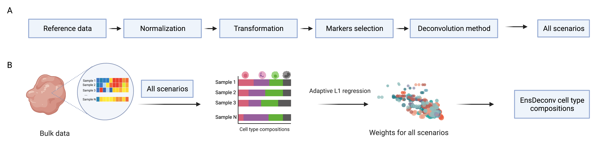

# EnsDeconv
EnsDeconv (Ensemble Deconvolution) which uses ensemble learning to to robustly estimate cellular fractions from bulk omics data.

## Installation
```
devtools::install_github("randel/EnsDeconv")
```

## Workflow

